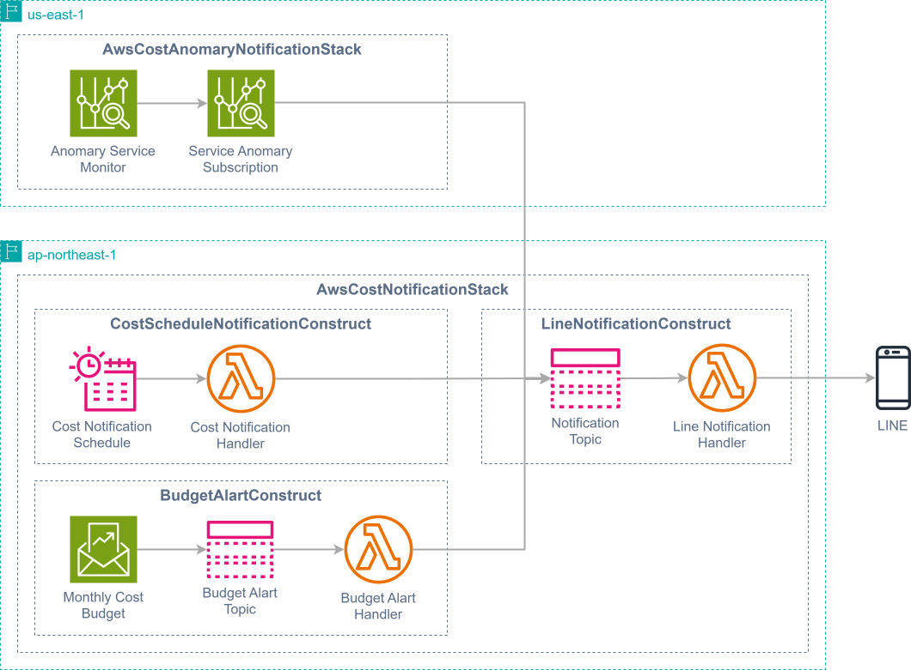

# AWSコスト通知アプリ

AWS の予想額と実際のコストを LINE に通知します。

## 機能

- コストのスケジュール通知
- 予算のアラート通知設定
- コスト異常通知
- LINE統合
- 為替変換

## インストール手順

1. リポジトリをクローン：

   ```bash
   git clone https://github.com/sasa9477/aws-cost-notification.git
   cd aws-cost-notification
   ```

2. 依存関係をインストール：

   ```bash
   npm install
   ```

3. graphviz のインストール：

   ```bash
   brew install graphviz
   ```

   cdk 構成図の作成に graphviz を使用します。構成図の作成は、エラーにならないため必須ではありません。  
   [こちら](https://graphviz.org/download/)からバイナリファイルをダウンロードすることもできます。

4. 環境変数を設定：

   ルートディレクトリに `.env` ファイルを作成し、次の変数を追加します。

   ```env
   LINE_CHANNEL_ID=line_channel_id
   LINE_CHANNEL_SECRET=line_channel_secret
   LINE_USER_ID=line_user_id
   EXCHANGE_RATE_API_KEY=your_exchange_rate_api_key
   ```

   - `LINE_CHANNEL_ID`: [LINE Messaging API](https://developers.line.biz/ja/reference/messaging-api/) のチャンネル ID（必須）
   - `LINE_CHANNEL_SECRET`: LINE Messaging API のチャンネルシークレット（必須）
   - `LINE_USER_ID`: LINE 公式アカウントの[ユーザー ID](https://developers.line.biz/ja/docs/messaging-api/getting-user-ids/#get-own-user-id)（必須）
   - `EXCHANGE_RATE_API_KEY`: [exchangerates](https://exchangeratesapi.io/) の API KEY (トークンが無い場合は 日本円 の為替変換は行いません)

5. アプリケーションをデプロイ：
   ```bash
   npm run deploy
   ```

## 設定

`config.ts` ファイルを編集して設定を変更できます。

#### コストのスケジュール通知の設定 (costScheduleNotificationConfig)

- `enabled`: コストのスケジュール通知の有効 / 無効を設定します。 (`boolean`)
- `scheduleExpression`: スケジュール実行の定義式を設定します。 (`string`)  
  詳細は [AWS CloudFormation Schedule Expression](http://docs.aws.amazon.com/AWSCloudFormation/latest/UserGuide/aws-resource-scheduler-schedule.html#cfn-scheduler-schedule-scheduleexpression) を参照してください。

#### 予算アラート通知設定 (budgetAlartConfig)

- `enabled`: 予算通知の有効 / 無効を設定します。 (`boolean`)
- `budgetAmount`: 予算額を設定します。 (`number`, 単位: USD)
- `actualAmountCostAlertThreshold`: 実績金額のアラート閾値を設定します。 (`number`, 単位: %)
- `forecastedAmountCostAlertThreshold`: 予測金額のアラート閾値を設定します。 (`number`, 単位: %)

#### コスト異常通知設定 (costAnomalyNotificationConfig)

- `enabled`: コスト異常通知の有効 / 無効を設定します。 (`boolean`)
- `forecastedAmountCostAlertThreshold`: 予想支出の異常通知アラートの閾値を設定します。 (`number`, 単位: USD)

## AWS 構成図

以下の AWS サービスによって構成されています。

### サービス概要図



### リソース構成図


